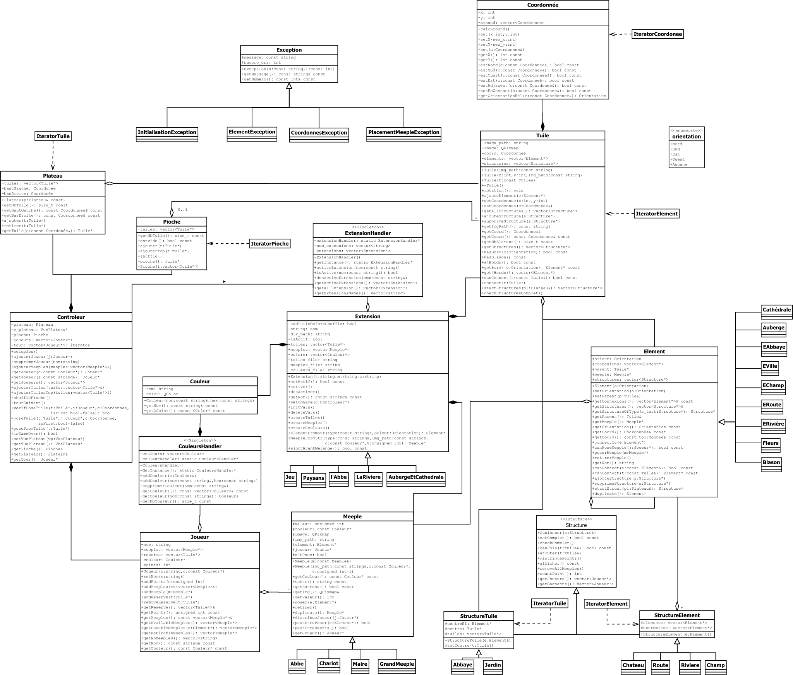

# Carcassonne LO21

Implementation of the carcassonne Game in C++ and Qt.

## Usage

You can compile the project in Qt Creator and the `interfacev.pro` file

## Architecture UML

## License

This project is licensed under the [MIT License](LICENSE.md).